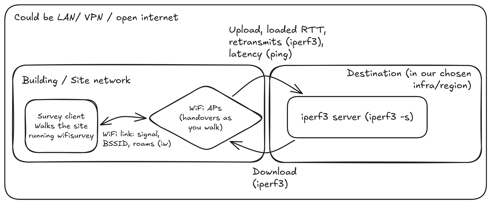
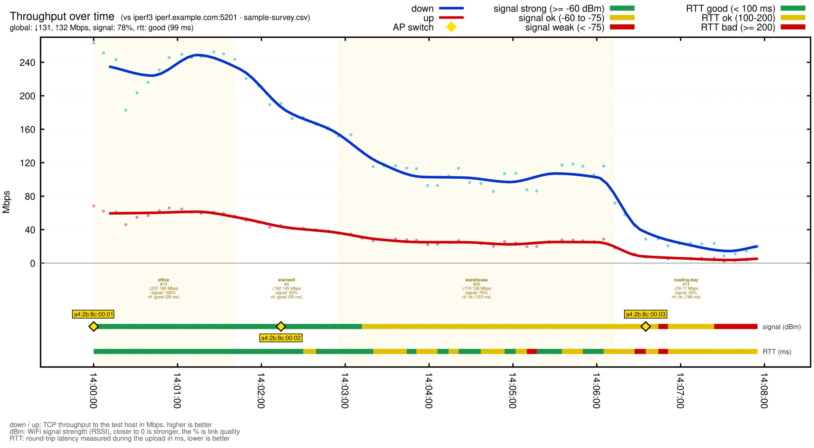

# wifisurvey

A command-line WiFi site survey tool. Walk a building, and at each spot it
measures real end-to-end throughput to a server you run (download and upload),
along with signal strength, latency, and access-point handovers, then reports
the weak spots. Throughput is measured with iperf3 against a server you control,
so the numbers reflect the actual path traffic takes to its destination rather
than just the local link.

The point is to measure the specific path you actually care about, from the
client (your laptop, walking the site) to a specific server you control, sitting
wherever your real traffic terminates. That can be on your LAN, but it is just
as often outside the building entirely, a VM in the same cloud region and infra
as the services you depend on. This way the survey reflects a concrete use case
rather than an abstract link-quality reading. For example, if you are deploying
an autonomous device or robot that streams up to, and pulls down from, services
in a particular region, run the iperf3 server on that same infra and survey from
the device's network: the weak spots you find are the ones that will actually
hurt that deployment, including the wider path, not just the local WiFi.

## Architecture



Every measurement traverses the whole path: download (server to client) and
upload (client to server) both ride the WiFi link, through the access point (if
any), to the iperf3 server you control. So the weak spots reflect your actual end-to-end
traffic, not just the local link.

## Requirements

- Linux with NetworkManager on the survey machine.
- `nmcli`, `iw`, `ping`, `iperf3`.
- Go 1.26+ to build.
- `gnuplot` (optional) to render `analyse --graph` into a figure.
- A reachable **iperf3 server** (the `--host`), see below. For a cloud path
  this is a small VM, ideally in the same region as the service you care about.

## Set up the throughput server

Run an iperf3 server on a machine that represents your traffic's real
destination. For a cloud target that is a small VM, ideally in the same region
as the service you care about:

```
sudo apt install -y iperf3
iperf3 -s
```

The survey machine just needs to reach that host on the iperf3 port (5201 by
default, or run `iperf3 -s -p N` and pass `--port N` to the survey). How you
make it reachable is your choice, a LAN address, a VPN or overlay network, or a
public IP. Two things to get right:

- **If you expose a public IP**, restrict the firewall for port 5201 to your
  own address, iperf3 has no authentication.
- **If you reach it through a VPN or overlay**, make sure the connection is
  direct rather than going through a relay, a relayed hop is bandwidth-capped
  and would understate the result.

## Build

```
make build
```

Or without make: `go build -o wifisurvey .`

## Usage

### Survey (walk and measure)

```
./wifisurvey survey --host <vm-name-or-ip>
make survey ARGS="--host <vm-name-or-ip>"
```

Connect the survey machine to the network you want to test, and make sure the
iperf3 server is running. Each reading runs a download then an upload test, so
it takes several seconds, walk slowly and pause at each spot. Type a landmark
name and press Enter to tag the following readings. Type `p` to pause readings
and `r` to resume, type `q` (then Enter) to stop.

Flags:

- `--host HOST` iperf3 server, a hostname or IP (required).
- `--port N` iperf3 server port (default 5201, match `iperf3 -s -p N`).
- `--csv FILE` output file (default `survey-<datetime>.csv`, a fresh file per
  run so walks are never appended together or overwritten). An explicit `FILE`
  that already exists is overwritten.
- `--up-time SECS` seconds for the upload test (default 3). The download test
  is a fixed 3s, it has headroom and settles instantly. On a congested or
  bufferbloated path a longer upload test rarely beats the run-to-run noise, so
  the short default gives more readings per walk. Raise it (e.g. 10-15) on a
  clean fast link where the extra ramp time actually pays off.

Live output, one line per reading. Here the signal fades down a corridor,
throughput drops and the loaded RTT (`rtt`) and retransmits (`retr`) climb with
it, the link clings to one access point well past the point it is useful, then
finally roams to a closer one:

```
time     where       bssid                down     up     rtt  qual  retr  dBm    %  note
14:02:09 corridor-a  a4:2b:8c:10:3f:01    30.2    7.8    48.0  good     2  -49 100%
14:02:16 corridor-a  a4:2b:8c:10:3f:01    28.1    6.9    95.0  good     9  -58  84%
14:02:23 corridor-a  a4:2b:8c:10:3f:01    19.4    4.9   210.0  poor    40  -69  62%
14:02:30 stairwell   a4:2b:8c:10:3f:01     8.6    2.1   640.0   bad   120  -74  52%
14:02:37 stairwell   a4:2b:8c:10:3f:02    27.0    6.8    90.0  good     8  -55  90%  roam from a4:2b:8c:10:3f:01
```

`rtt`, `qual`, and `retr` come from the upload test. `rtt` is the round-trip
*during* the transfer (the bufferbloat, climbing to 640ms at the stairwell),
`qual` is a quick grade for it (good <100ms, ok <200, poor <400, bad otherwise),
the latency analogue of the `%` next to dBm, and `retr` is TCP retransmits (a
packet-loss proxy). High RTT and loss wreck real-time traffic more than a
merely-low bitrate does, so they often flag a bad spot before the Mbps looks
alarming.

### Analyse (find weak spots)

```
./wifisurvey analyse --min-up 5
make analyse ARGS="--min-up 5"
```

Groups the survey by landmark, worst first by average upload, and flags any
spot whose upload falls below the threshold (upload is the direction that
matters when a device is sending data out, such as streaming).

Flags:

- `--csv FILE` input file (default: the most recent `survey-*.csv`).
- `--min-up MBPS` weak upload threshold in Mbps (default 5). A spot is flagged
  `WEAK` when its **average** upload falls below this. Spots where the upload
  test never succeeded show `no up` and are counted as weak.
- `--min-down MBPS` optional average-download threshold (default 0, off). When
  set, a spot is also flagged `WEAK` if its average download falls below this,
  useful if the device relies on download too, not just upload.
- `--graph FILE` also writes a self-contained **gnuplot** script (data inline).
  The image format follows the extension: `.gp` or none renders a PDF
  (`gnuplot FILE.gp`), `.png` a PNG. The chart plots throughput over time with
  per-location and overall averages, a signal (dBm) and a loaded-RTT colour
  bar, and the access-point handovers:



Example output (from the survey above, with a couple more landmarks):

```
where           dn avg  dn min  up avg  up min rtt avg  qual  retr   dBm    %   n  APs  status
basement             -       -       -       -       -     -     0   -83  34%   1    1  no up
stairwell         17.8     8.6     4.5     2.1   365.0  poor   128   -65  70%   2    2  WEAK
corridor-a        23.8    19.4     5.9     4.9   152.5    ok    49   -64  72%   2    1  ok
office            30.3    29.6     7.9     7.6    48.5  good     8   -49 100%   2    1  ok

2 weak/unmeasured spot(s) below 5 Mbps up: basement, stairwell
```

Reading it: `office` is comfortable, low RTT (`good`) and few retransmits.
`corridor-a` clears the bar on average (5.9 Mbps up) though its worst reading
dipped to 4.9 and RTT is creeping up (`ok`), one to watch. The `stairwell` is a
roaming zone (`APs` 2) where average upload fell to 4.5 Mbps, RTT averaged
365ms (`poor`), and retransmits hit 128, that combination is far worse for live
traffic than the bitrate alone suggests. The `basement` had no usable
connection at all. Note `rtt avg`, `qual`, and `retr` come from the upload
test, so they are blank for spots with no upload.

## Output columns

| Column   | Meaning                                                          |
|----------|------------------------------------------------------------------|
| down     | Download throughput to the server, Mbps (aggregate, 8 streams).  |
| up       | Upload throughput to the server, Mbps. The streaming direction.  |
| rtt      | Loaded round-trip during the upload test, ms (live shows each reading's peak, analyse the average). The bufferbloat. |
| qual     | RTT grade: good <100ms, ok <200, poor <400, bad otherwise.       |
| retr     | TCP retransmits during the upload test. A packet-loss proxy.     |
| dBm      | Signal strength. Closer to zero is stronger, -67 is a good floor.|
| %        | Signal as a quality percentage, derived from dBm.                |
| n        | Number of readings at that spot.                                 |
| APs      | Distinct access points (BSSIDs) seen at that spot.               |
| note     | `roam from <bssid>` when the connection switched access point.   |

`rtt` and `retr` are measured on the upload test only, so they are blank for a
reading whose upload failed. The live display also drops the idle `ms` latency
to stay narrow, but the CSV keeps it as `latency_ms` (a baseline ping to the
server, taken between tests).

The CSV columns are `timestamp`, `label`, `ssid`, `bssid`, `signal_dbm`,
`signal_pct`, `mbps_down`, `mbps_up`, `rtt_ms`, `retr`, `latency_ms`, `note`.
The `bssid` column holds the access point you were connected to, so a roam row
records both ends, the source in `note` and the destination in `bssid`.

## Notes

- **Measure to a representative server.** Point `--host` at something on your
  traffic's real path. A cloud VM in the destination's region measures the true
  internet path, a LAN box only measures your local link.
- **Beware relays.** If you reach the server through a VPN or overlay, confirm
  the connection is direct, a relayed hop is bandwidth-capped and would
  understate the result.
- **Single streams under-report.** The survey uses 8 parallel iperf3 streams to
  get an accurate aggregate, a single TCP stream caps low on long paths and is
  not comparable to a browser speed test.
- **Signal explains the throughput.** A spot with weak dBm and high APs (a
  roaming zone) is where loss and stalls appear, even if the average looks fine.

## Development

```
make test           # go test ./...
make check          # gofmt, vet, and test
```
